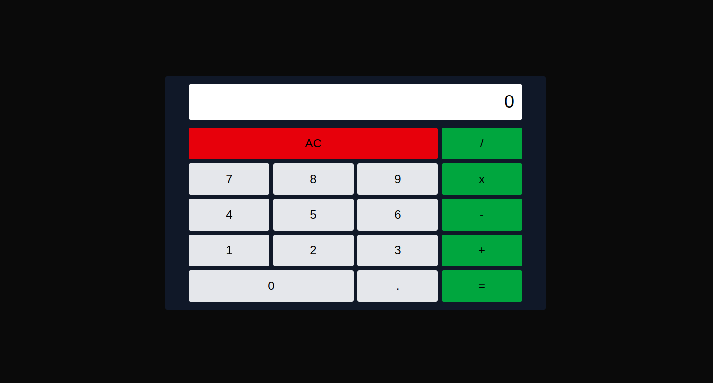

# Calculadora em Next.js

> Projeto de uma calculadora simples construída com Next.js e Tailwind CSS.

## Como rodar este projeto

Primeiro, instale dependências e rode o servidor de desenvolvimento:

```bash
npm install
npm run dev
# ou
yarn
yarn dev
```

Abra http://localhost:3000 no navegador para ver a aplicação.
## Preview (GitHub Pages)
Você pode ver um preview hospedado no GitHub Pages:
[https://dev-gabriel-silva.github.io/calculadora-next-js/](https://dev-gabriel-silva.github.io/calculadora-next-js/)



## Testes
Testes unitários usam Vitest. Para rodar os testes:
```bash
npm test
# ou
npm run test:watch
## Observações
- Este repositório contém uma implementação simples da lógica da calculadora no arquivo `app/page.js`.
- Planejamento: extrair `Screen` e `Keyboard` em componentes e mover a lógica para um hook (`useCalculator`) para melhor testabilidade e reutilização.